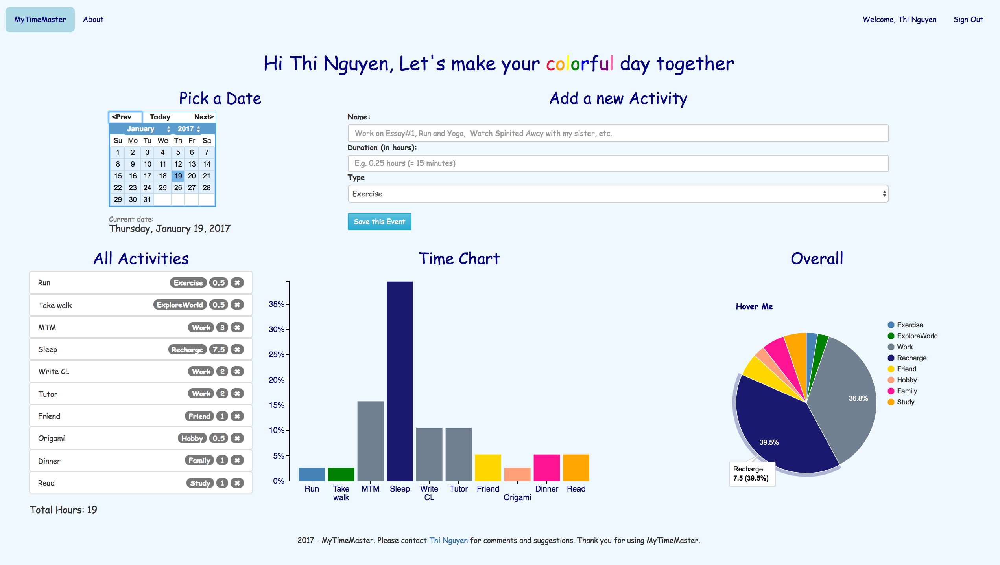

# MyTimeMaster
A time management and planner application

Live Demo available at Heroku: https://afternoon-reef-38020.herokuapp.com/

Note: This project is in process. Demo has not yet fully reflected the App's description below. 

## What is MyTimeMaster?
MyTimeMaster (MTM) is a time management and planner application.
With MyTimeMaster app, you can create a personal account and use the app as a tool to plan and allocate your time daily/weekly/monthly.
You will input what you plan to do for certain hours of a day and the type of that activity (e.i. Work, Study, Exercise, etc).
The app will display the list of activities you created in certain days and the visualization of how the you allocate your time.
You can also share your activities with friends on Facebook.
## MyTimeMaster's mission:
MTM app aims to promote users with a habit of managing time wisely and living a fulfilled and balanced life.
Specifically, the app will show the percentage of each activity category that users allocate daily
(weekly/monthly not set supported) and display the information with d3.js data visualization.
The visualization can help users determine their work-life balance or their productivity.

## Credit
[jQuery Datepicker](http://keith-wood.name/datepick.html) by Keith Wood

The bar chart is adopted from [Wrapping Long Labels](https://bl.ocks.org/mbostock/7555321) by Mike Bostock

## Screenshot
